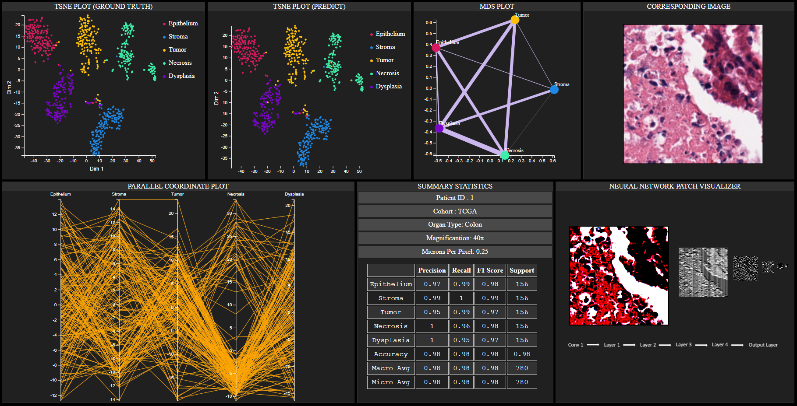

# Histopathology-Dashboard

This dashboard visualizes a deep learning model's analysis which is trained on colon cancer data. Histopathology Poster.pdf contains the details of our work. This project is done for [CSE 564](https://www3.cs.stonybrook.edu/~mueller/teaching/cse564/index.html). This visualization project has been selected as one of the star :star: projects of CSE 564. Some of the sample data are stored into static folder. Full data will be released later. 
This [link](https://www.youtube.com/watch?v=47IHEceO4hA&list=PLyCRt3MN8s8OJp-M5UdCQv-NDllAqJOb5&index=3) contains the demo video of our dashboard.
Following is a snapshot of our Dashboard.

